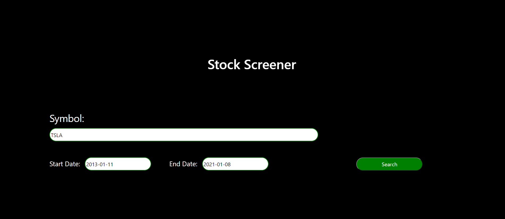
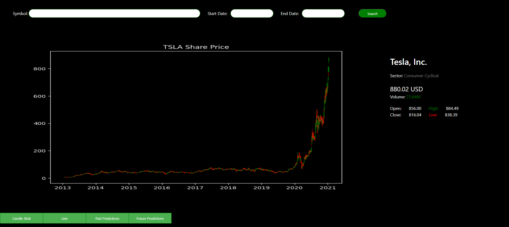
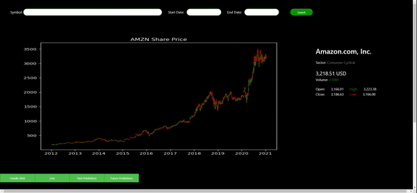

# Stock Screening and Predicting Platform
A Django web application which scrapes data from Yahoo Finance and displays on a user friendly platform. Additional, Using a Recurrent Neural Network Long Short Term Memory Model (LSTM), predicts future stock prices.

## Installation

First navigate to the djnago folder with the following command.

```bash
cd Djnago-backend

```
Use the package manager [pip](https://pip.pypa.io/en/stable/) to install virtual environnement.

```bash
python -m pip install virtualenv
```

Next create virtual environment using.

```bash
virtualenv venv
```

Finally, activate your venv.

```bash
venv/Scripts/activate
```

Use the package manager [pip](https://pip.pypa.io/en/stable/) to install the dependencies.

```bash
pip install -r requirements.txt
```

## Usage

Run the server and open the URL presented navigated

```bash
python manage.py runserver
```

Next go to the URL http://127.0.0.1:8000/stocks/ and fill in the required fields to start the stock screening.
\
\

\
\
Upon starting the search you will be redirected to a page with the stock information and charts.  <span style="color:red">(due to data training this process can take 1-2 minutes)</span>
\
\

\
\
To view the past and future predictions, simply click on the related tabs on the bottom right.


## Full Visualization
\

\

## How it works

1. Data Scraping:
    - Using a web-scraping script, program extracts JSON data from Yahoo Finance and plots the candlestick and line charts as well as displaying basic stock information such as current, open, close prices import links, and company description.

    - Main Libraries Used: Pandas, Beautiful Soup, Matplotlib, Mpl_finance


2. Price Predation:
    - Program uses a Long Short Term Memory (LSTM) to train and predict stock price trends. A Long short-term memory (LSTM) is an artificial recurrent neural network (RNN) used in the field of deep learning. LSTM networks are well-suited to classifying, processing and making predictions based on time series data, since there can be lags of unknown duration between important events in a time series.

    - In case of predicting past prices, closing price of 80% of data gets trained and using the model, program predicts the prices for the remaining days while optimizing the model itself according the price error everyday.

    - The LSTM model of this platform trains closing price of 100% data from the chosen start date to the  end date, and predicts price trends for future 2 month, 6 month, and 1 year periods.

    - Main Libraries Used: Tensorflow, Keras, Numpy


## Contributing
Pull requests are welcome. For major changes, please open an issue first to discuss what you would like to change.

Please make sure to update tests as appropriate.


## Possible Future Improvements

1- The main aim is to design the LSTM model in a more flexible way, such that it adjusts itself according the condition of the market and the volume. adding more deciding factors rather on focusing only on prices.

2- Increasing the speed and efficiency of them model.


## License
[MIT](https://choosealicense.com/licenses/mit/)

